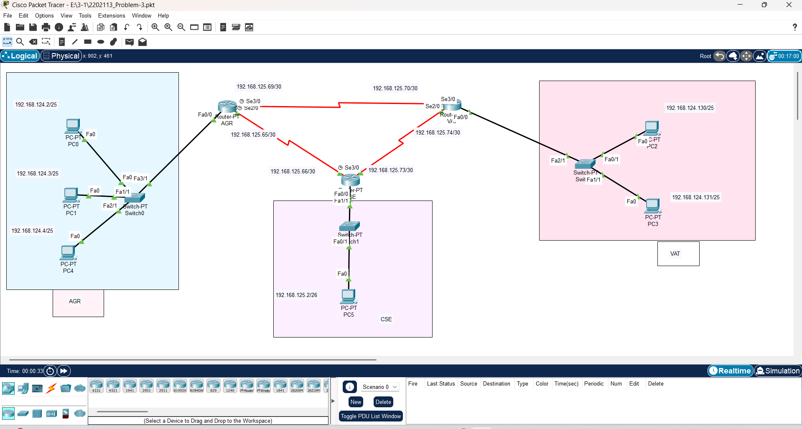

# 🌐 Cisco Packet Tracer Project - 3 Router Network Topology

This repository contains my **Cisco Packet Tracer lab file (.pkt)** where I have implemented a **3-router network topology** for practicing networking concepts.

---

## 🔹 Topology Overview
- **Routers:** AGR, CSE, VAT  
- **LAN Subnets:**  
  - AGR LAN → 192.168.124.0/25  
  - CSE LAN → 192.168.125.0/26  
  - VAT LAN → 192.168.124.128/25  
- **Serial Links (/30):**  
  - AGR ↔ CSE → 192.168.125.64/30  
  - AGR ↔ VAT → 192.168.125.68/30  
  - CSE ↔ VAT → 192.168.125.72/30  

---

## 🔹 Devices Used
- 🖥️ PCs for end devices  
- 🔀 Switches for local LAN connectivity  
- 📡 Routers for inter-network communication  

---

## 🔹 Key Configurations
- **IP Addressing & Subnetting**  
- **Router Interfaces Setup**  
- **Routing (Static / Dynamic can be applied)**  
- **End-to-End Connectivity (PC ↔ PC across different LANs)**  

---

## 📷 Topology Screenshot

---

## 🔹 How to Use
1. Download the `.pkt` file from this repo.  
2. Open it with **Cisco Packet Tracer** (v8.2 or later recommended).  
3. Test connectivity using `ping` between PCs.  
4. Try adding **RIP/OSPF routing** to make it more dynamic.  

---

## 🔹 Learning Outcome
- Hands-on practice with **subnetting**  
- Router-to-router **serial connections**  
- Configuring **static routes / dynamic routing protocols**  
- Verifying **LAN to LAN communication**  

---

## 📌 Author
👤 **Foysal Iqbal**  
🚀 Networking Enthusiast | Learning by Doing  
